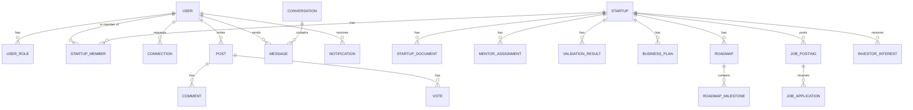
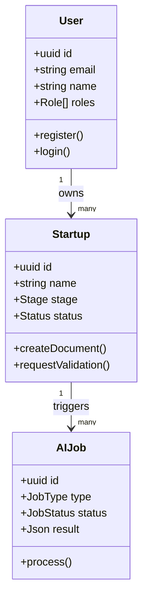
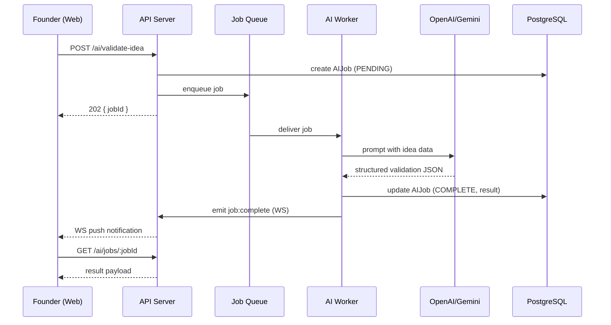

# NEXORA
### "From Idea to Impact."
## Master Software Requirement Specification & System Architecture

**Version:** 1.0
**Document Type:** Production Architecture Blueprint
**Stack:** React + TypeScript + Vite + Tailwind (Frontend) | Node.js + Express + Prisma + PostgreSQL (Backend) | Socket.io (Realtime) | OpenAI/Gemini (AI)

---

## TABLE OF CONTENTS

1. Software Requirement Specification (SRS)
2. Functional Requirements
3. Non-Functional Requirements
4. User Roles
5. Complete Feature Breakdown (incl. added features)
6. System Architecture
7. Folder Structure (Monorepo)
8. API Architecture
9. Database Design
10. UI/UX Flow
11. Page List
12. Dashboard Design
13. Authentication Flow
14. Database Schema (Prisma)
15. ER Diagram
16. UML Diagrams
17. User Journey
18. Development Roadmap
19. Security Considerations
20. Deployment Plan
21. README.md (Root Project)

---

## 1. SOFTWARE REQUIREMENT SPECIFICATION (SRS)

### 1.1 Purpose
Nexora is an AI-powered startup ecosystem platform that unifies idea validation, business planning, team building, networking, community discussion, mentorship, investor discovery, and personalized market intelligence into a single product, eliminating the need for founders to stitch together multiple disconnected tools.

### 1.2 Scope
The system will support five roles (Founder, Mentor, Investor, Team Member, Admin), provide AI-assisted decision tools, real-time communication, a public marketing site, and a scalable backend capable of handling growing startups, documents, chat, and personalized content feeds.

### 1.3 Intended Audience
Engineering team (frontend, backend, database, DevOps), product managers, QA, and future contributors onboarding to the codebase.

### 1.4 Definitions
- **Founder** — creates and manages a startup.
- **Startup Entity** — a company/idea record owned by one or more founders.
- **Incubation Pipeline** — the stage-based lifecycle a startup moves through (Idea → Validation → MVP → Launch → Growth → Funding).
- **Match Score** — AI-computed compatibility value between two entities (e.g., founder ↔ mentor).

### 1.5 Assumptions & Dependencies
- Third-party AI provider (OpenAI or Gemini) API availability.
- Object storage (S3/Cloudinary) for documents, pitch decks, and avatars.
- Email service provider (e.g., Resend/SendGrid/SES) for verification and notifications.
- OAuth provider (Google) credentials.

---

## 2. FUNCTIONAL REQUIREMENTS

| ID | Requirement |
|----|-------------|
| FR-01 | Users can register/login via email-password or Google OAuth |
| FR-02 | System enforces role-based access control (RBAC) for 5 roles |
| FR-03 | Founders can create, edit, and manage startup profiles with documents |
| FR-04 | Admins can approve/reject startups and assign mentors |
| FR-05 | Users can search, connect, and follow other users (networking) |
| FR-06 | Users can create posts, comment, upvote in community forums |
| FR-07 | Users can chat in real time with typing indicators & read receipts |
| FR-08 | Founders can post team/job openings; candidates can apply |
| FR-09 | AI Matching suggests co-founders/team members by skill vector similarity |
| FR-10 | Mentors can view assigned startups, log notes, schedule meetings |
| FR-11 | Investors can browse/filter startups and express investment interest |
| FR-12 | AI Idea Validation returns a structured score + SWOT + risks |
| FR-13 | AI Business Plan Generator produces exportable PDF business plans |
| FR-14 | AI Roadmap Planner generates milestone-based task timelines |
| FR-15 | AI Recommendation Engine suggests mentors/investors/events/resources |
| FR-16 | AI Market Insights feed is personalized per founder profile & activity |
| FR-17 | System sends notifications (in-app, email, and push-ready) for key events |
| FR-18 | Public website serves marketing pages without authentication |
| FR-19 | Users can reset password via secure token-based email flow |
| FR-20 | All file uploads are validated, virus-scanned (hook), and stored in object storage |

---

## 3. NON-FUNCTIONAL REQUIREMENTS

| Category | Requirement |
|---|---|
| **Performance** | API p95 response < 300ms (non-AI endpoints); AI endpoints streamed |
| **Scalability** | Stateless API servers behind load balancer; horizontal scaling; read replicas |
| **Availability** | 99.9% uptime target; graceful degradation if AI provider fails |
| **Security** | OWASP Top 10 mitigations, encrypted secrets, hashed passwords (argon2/bcrypt) |
| **Usability** | WCAG 2.1 AA accessibility, responsive down to 360px width |
| **Maintainability** | Modular monorepo, typed contracts (shared types package), lint/format enforced |
| **Observability** | Structured logging, request tracing, error monitoring (Sentry) |
| **Portability** | Fully containerized (Docker), 12-factor config via env vars |
| **Testability** | Unit + integration + e2e test suites, CI gate on PRs |
| **Data Retention** | Soft-delete for user-generated content; audit log for admin actions |

---

## 4. USER ROLES

| Role | Description | Key Permissions |
|---|---|---|
| **Founder** | Owns/manages startups | CRUD own startup, use AI tools, chat, apply to network, post jobs |
| **Mentor** | Guides assigned startups | View assigned startups, add notes/feedback, schedule meetings |
| **Investor** | Discovers & tracks startups | Browse/filter/save startups, request meetings, express interest |
| **Team Member** | Joins startups as contributor | Apply to job posts, view startup workspace, chat |
| **Admin** | Platform operator | Approve/reject startups, assign mentors, manage users, moderate community, view analytics |

> **Design note:** A single user account can hold multiple roles simultaneously (e.g., a Mentor who is also a Founder) via a `UserRole` join table rather than a single fixed role field — this better reflects real-world ecosystem behavior and avoids duplicate accounts.

---

## 5. COMPLETE FEATURE BREAKDOWN

### 5.1 Original Modules (as specified)
All 15 core modules from the brief are retained in full: Authentication, Startup Management, Networking, Community, Chat, Team Builder, Mentor Module, Investor Module, AI Idea Validation, AI Business Plan Generator, AI Roadmap Planner, AI Recommendation Engine, AI Market Insights, Notifications, Public Website.

### 5.2 Added Features (with justification)

| Added Feature | Why It Adds Value |
|---|---|
| **Multi-role accounts** | Real founders often mentor or invest too; avoids fragmented duplicate profiles. |
| **Startup Workspace (Kanban + Docs)** | Once a team is formed, they need a shared execution space — keeps teams inside Nexora instead of exporting to Trello/Notion. |
| **Cap Table Lite** | Lightweight equity split tracker so early founders don't need a separate tool before they can afford full cap-table software. |
| **Events & Pitch Competitions Module** | Referenced in AI Market Insights as a recommendation source; giving it a first-class module (create/RSVP/host) closes the loop instead of just linking externally. |
| **Verified Investor/Mentor Badge** | Builds trust signal so founders know who is legitimate — important since real money/advice changes hands. |
| **Audit Log & Admin Analytics Dashboard** | Needed for platform governance, moderation accountability, and growth tracking; expected in any production SaaS. |
| **Rate limiting & abuse reporting on Community/Chat** | Prevents spam/harassment which is a real risk in any open networking + chat platform. |
| **Versioned Business Plans & Pitch Decks** | Founders iterate constantly; keeping version history prevents accidental loss of earlier drafts investors may have already seen. |
| **Webhooks for AI job completion** | Business plan / roadmap generation can take time; async job + webhook/callback avoids blocking UI and enables retry/scaling of AI workers. |
| **Search Service (Postgres full-text / optional Elastic)** | Startups, people, posts, and jobs all need fast unified search; called out implicitly by "Search People" and "Search Startups" but formalized as a shared service. |

---

## 6. SYSTEM ARCHITECTURE

### 6.1 High-Level Architecture

```
                                   ┌────────────────────────┐
                                   │      Public Website     │
                                   │   (Marketing / SEO)     │
                                   └───────────┬─────────────┘
                                               │
┌───────────────┐     HTTPS/REST/WS   ┌────────▼────────┐        ┌──────────────────┐
│  React SPA     │◄───────────────────►│   API Gateway   │◄──────►│   Auth Service    │
│ (Vite + TS)    │                     │ (Express + BFF) │        │ (JWT + OAuth)     │
└───────────────┘                     └───┬──────┬───────┘        └──────────────────┘
                                           │      │
                    ┌──────────────────────┘      └────────────────────────┐
                    │                                                       │
          ┌─────────▼─────────┐                                  ┌─────────▼─────────┐
          │   Core Domain API  │                                  │  Realtime Gateway   │
          │ (Startups, Users,  │                                  │   (Socket.io)       │
          │  Community, Team)  │                                  └─────────┬───────────┘
          └─────────┬──────────┘                                            │
                    │                                                       │
          ┌─────────▼──────────┐     ┌────────────────────┐      ┌─────────▼──────────┐
          │  PostgreSQL (Prisma)│     │   AI Worker Service │      │   Redis (pub/sub,   │
          │  Primary + Replica  │◄───►│ (Queue: BullMQ)     │      │   cache, sessions)   │
          └──────────────────────┘     │ OpenAI/Gemini calls │      └──────────────────────┘
                                        └────────┬───────────┘
                                                 │
                                    ┌────────────▼────────────┐
                                    │  Object Storage (S3 /    │
                                    │  Cloudinary) — decks,    │
                                    │  docs, avatars, exports  │
                                    └──────────────────────────┘
```

### 6.2 Architectural Style
- **Modular Monolith** at launch (bounded contexts by domain module, single deployable), designed with clear internal service boundaries so any module (e.g., AI, Chat) can be extracted into its own microservice later without rewriting business logic.
- **BFF pattern**: the Express API acts as the single entry point for the SPA; internal modules communicate via typed service classes, not HTTP, to avoid premature microservice overhead.
- **Async AI processing**: long-running AI tasks (business plan, roadmap) go through a BullMQ job queue backed by Redis so the API stays responsive; frontend polls or listens via WebSocket for completion.

### 6.3 Cross-Cutting Concerns
- Centralized error handler + typed error classes.
- Request validation via Zod schemas shared between client and server (in a `packages/shared` workspace).
- Centralized RBAC middleware evaluated per-route and per-resource (ownership checks for startups, e.g. a Founder can only edit their own startup).

---

## 7. FOLDER STRUCTURE (Monorepo)

```
nexora/
├── apps/
│   ├── web/                        # React + Vite + TS frontend
│   │   ├── public/
│   │   ├── src/
│   │   │   ├── app/                # App shell, router, providers
│   │   │   ├── pages/              # Route-level pages
│   │   │   ├── features/           # Feature-sliced modules (auth, startups, chat, ai, ...)
│   │   │   │   └── <feature>/
│   │   │   │       ├── components/
│   │   │   │       ├── hooks/
│   │   │   │       ├── api.ts
│   │   │   │       ├── types.ts
│   │   │   │       └── index.ts
│   │   │   ├── components/ui/      # Reusable design-system components
│   │   │   ├── lib/                # axios instance, query client, socket client
│   │   │   ├── stores/             # lightweight global state (Zustand) if needed
│   │   │   ├── styles/
│   │   │   └── main.tsx
│   │   ├── index.html
│   │   ├── vite.config.ts
│   │   └── package.json
│   │
│   └── api/                        # Node.js + Express backend
│       ├── src/
│       │   ├── modules/
│       │   │   ├── auth/
│       │   │   ├── users/
│       │   │   ├── startups/
│       │   │   ├── networking/
│       │   │   ├── community/
│       │   │   ├── chat/
│       │   │   ├── team-builder/
│       │   │   ├── mentorship/
│       │   │   ├── investors/
│       │   │   ├── ai/
│       │   │   │   ├── validation/
│       │   │   │   ├── business-plan/
│       │   │   │   ├── roadmap/
│       │   │   │   ├── recommendations/
│       │   │   │   └── market-insights/
│       │   │   ├── notifications/
│       │   │   └── admin/
│       │   │       (each module: controller.ts, service.ts, routes.ts,
│       │   │        validation.ts, types.ts)
│       │   ├── middlewares/        # auth, rbac, error-handler, rate-limit
│       │   ├── jobs/                # BullMQ queues/workers (AI, email, notifications)
│       │   ├── sockets/             # Socket.io namespaces & handlers
│       │   ├── config/              # env loader, constants
│       │   ├── lib/                 # prisma client, redis client, s3 client, ai client
│       │   ├── utils/
│       │   └── server.ts
│       ├── prisma/
│       │   ├── schema.prisma
│       │   ├── migrations/
│       │   └── seed.ts
│       └── package.json
│
├── packages/
│   ├── shared-types/                # Shared TS interfaces/DTOs
│   ├── shared-schemas/              # Zod validation schemas (used by web + api)
│   └── config/                      # Shared eslint/tsconfig/prettier configs
│
├── docs/                            # Architecture docs, ADRs, API docs
├── docker/
│   ├── Dockerfile.web
│   ├── Dockerfile.api
│   └── docker-compose.yml
├── .github/workflows/                # CI pipelines
├── turbo.json / nx.json              # Monorepo task runner config
├── package.json
└── README.md
```

---

## 8. API ARCHITECTURE

### 8.1 Conventions
- Base URL: `/api/v1`
- REST + resource-oriented; AI endpoints return job IDs for async work.
- All responses: `{ success: boolean, data?: T, error?: { code, message } }`
- Pagination: cursor-based (`?cursor=&limit=`) for feeds/chat; offset-based for admin tables.
- Versioning via URL prefix (`/api/v1`, future `/api/v2`).

### 8.2 Key Endpoint Groups

```
AUTH
POST   /api/v1/auth/register
POST   /api/v1/auth/login
POST   /api/v1/auth/google
POST   /api/v1/auth/refresh
POST   /api/v1/auth/forgot-password
POST   /api/v1/auth/reset-password
GET    /api/v1/auth/verify-email/:token

USERS
GET    /api/v1/users/me
PATCH  /api/v1/users/me
GET    /api/v1/users/:id
GET    /api/v1/users/search?q=

STARTUPS
POST   /api/v1/startups
GET    /api/v1/startups/:id
PATCH  /api/v1/startups/:id
DELETE /api/v1/startups/:id
POST   /api/v1/startups/:id/documents
GET    /api/v1/startups/:id/timeline
PATCH  /api/v1/startups/:id/status          (admin)
POST   /api/v1/startups/:id/assign-mentor   (admin)

NETWORKING
POST   /api/v1/connections/:userId/request
POST   /api/v1/connections/:userId/accept
POST   /api/v1/follows/:userId

COMMUNITY
GET    /api/v1/posts?category=&sort=
POST   /api/v1/posts
POST   /api/v1/posts/:id/comments
POST   /api/v1/posts/:id/vote

CHAT (REST bootstrap; live via WS)
GET    /api/v1/conversations
GET    /api/v1/conversations/:id/messages
POST   /api/v1/conversations/:id/messages

TEAM BUILDER
POST   /api/v1/jobs
GET    /api/v1/jobs?skill=&domain=
POST   /api/v1/jobs/:id/apply
GET    /api/v1/matches/co-founders

MENTORSHIP
GET    /api/v1/mentor/assigned-startups
POST   /api/v1/mentor/notes
POST   /api/v1/mentor/meetings

INVESTOR
GET    /api/v1/investor/startups?stage=&industry=
POST   /api/v1/investor/interest/:startupId
POST   /api/v1/investor/meeting-request/:startupId

AI
POST   /api/v1/ai/validate-idea              -> { jobId }
POST   /api/v1/ai/business-plan              -> { jobId }
POST   /api/v1/ai/roadmap                    -> { jobId }
GET    /api/v1/ai/jobs/:jobId                -> status/result
GET    /api/v1/ai/recommendations
GET    /api/v1/ai/market-insights/feed

NOTIFICATIONS
GET    /api/v1/notifications
PATCH  /api/v1/notifications/:id/read

ADMIN
GET    /api/v1/admin/startups/pending
GET    /api/v1/admin/analytics
GET    /api/v1/admin/audit-log
```

### 8.3 WebSocket Events (Socket.io)

```
Namespace: /chat
  client -> server: message:send, typing:start, typing:stop
  server -> client: message:receive, message:read, typing:update

Namespace: /notifications
  server -> client: notification:new

Namespace: /ai
  server -> client: job:progress, job:complete, job:failed
```

---

## 9. DATABASE DESIGN

### 9.1 Design Principles
- PostgreSQL as single source of truth; Prisma ORM for type-safe access.
- UUID primary keys for all entities (avoids ID enumeration, safe for distributed generation).
- Soft deletes (`deletedAt`) on user-generated content.
- All timestamps in UTC (`createdAt`, `updatedAt`).
- Many-to-many relations (roles, skills, connections) modeled via explicit join tables to allow metadata (e.g., connection status, role granted date).

### 9.2 Core Entities
`User, UserRole, Profile, Startup, StartupDocument, StartupMember, MentorAssignment, Connection, Follow, Post, Comment, Vote, Conversation, Message, JobPosting, JobApplication, InvestorInterest, MeetingRequest, AIJob, ValidationResult, BusinessPlan, Roadmap, RoadmapMilestone, Notification, Event, AuditLog`

(Full field-level schema in Section 14.)

---

## 10. UI/UX FLOW

### 10.1 Primary Flow (Founder)
```
Landing Page → Sign Up → Onboarding (role + interests) → Founder Dashboard
   → Create Startup → AI Idea Validation → AI Business Plan → Team Builder
   → Networking / Community → Mentor Assigned (by Admin) → Chat with Mentor
   → Investor Discovery → Meeting Requests → Market Insights Feed (ongoing)
```

### 10.2 Design Language
- Clean, confident, "builder" aesthetic — not generic SaaS blue. Primary palette: deep indigo + warm accent (amber/coral) to signal energy + trust.
- Data-dense dashboards use card-based modular widgets with consistent spacing scale (4/8/12/16/24/32).
- Feed-style AI Market Insights mimics familiar social-feed scanning patterns (card + reason chip explaining "why you're seeing this").

### 10.3 Navigation Model
- Persistent left sidebar (role-aware: nav items differ per role) + top bar (search, notifications, profile).
- Mobile: bottom tab bar (Home, Network, Community, Chat, Profile).

---

## 11. PAGE LIST

**Public**
- `/` Landing, `/about`, `/features`, `/pricing`, `/showcase`, `/events`, `/success-stories`, `/contact`, `/faq`, `/login`, `/register`, `/forgot-password`

**Founder**
- `/dashboard`, `/startups/new`, `/startups/:id`, `/startups/:id/edit`, `/startups/:id/workspace`, `/ai/validate`, `/ai/business-plan`, `/ai/roadmap`, `/team/find`, `/team/jobs/new`, `/network`, `/community`, `/community/:postId`, `/chat`, `/insights` (Market Insights feed), `/profile/:id`, `/settings`

**Mentor**
- `/mentor/dashboard`, `/mentor/startups/:id`, `/mentor/meetings`, `/mentor/notes/:startupId`

**Investor**
- `/investor/dashboard`, `/investor/browse`, `/investor/startups/:id`, `/investor/saved`, `/investor/meetings`

**Team Member**
- `/jobs`, `/jobs/:id`, `/applications`, `/workspace/:startupId`

**Admin**
- `/admin/dashboard`, `/admin/startups/pending`, `/admin/users`, `/admin/mentors/assign`, `/admin/community/moderation`, `/admin/analytics`, `/admin/audit-log`

---

## 12. DASHBOARD DESIGN

### 12.1 Founder Dashboard Widgets
Startup progress tracker (stage bar), pending AI jobs, unread messages, upcoming meetings, top 3 market insight cards, team application count, quick actions (New Startup, Run Validation).

### 12.2 Mentor Dashboard Widgets
Assigned startups list with last-activity indicator, upcoming meetings calendar, pending feedback tasks.

### 12.3 Investor Dashboard Widgets
Saved startups, new matches this week, meeting requests pending response, portfolio interest pipeline (Kanban: Watching → Interested → Meeting → Passed/Invested).

### 12.4 Admin Dashboard Widgets
Pending startup approvals queue, platform growth chart (signups, active startups), moderation queue, mentor-assignment backlog, system health.

---

## 13. AUTHENTICATION FLOW

```
1. Register (email/password) → hash password (argon2) → create User (unverified)
   → send verification email (JWT token, 24h expiry)
2. Verify Email → activate account
3. Login → validate credentials → issue Access Token (JWT, 15 min) +
   Refresh Token (httpOnly secure cookie, 7 days, rotated on use)
4. Google OAuth → verify Google ID token → find-or-create User → issue tokens
5. Protected requests → Access Token in Authorization header → auth middleware
   verifies signature + expiry → attaches req.user
6. Refresh → client calls /auth/refresh with cookie → new access token issued;
   refresh token rotation + reuse detection invalidates all sessions on breach
7. Forgot Password → emailed reset token (1h expiry, single-use, hashed at rest)
8. RBAC → role/permission check middleware runs after auth, before controller
```

**Session storage:** Refresh tokens stored hashed in DB (`Session` table) to allow revocation (logout-all, breach response).

---

## 14. DATABASE SCHEMA (Prisma)

```prisma
// schema.prisma (excerpt — core models)

model User {
  id            String    @id @default(uuid())
  email         String    @unique
  passwordHash  String?
  googleId      String?   @unique
  name          String
  avatarUrl     String?
  bio           String?
  location      String?
  industry      String?
  skills        String[]
  interests     String[]
  isVerified    Boolean   @default(false)
  createdAt     DateTime  @default(now())
  updatedAt     DateTime  @updatedAt
  deletedAt     DateTime?

  roles         UserRole[]
  startups      StartupMember[]
  posts         Post[]
  comments      Comment[]
  sentMessages  Message[]        @relation("SentMessages")
  notifications Notification[]
  sessions      Session[]
  connectionsA  Connection[]     @relation("ConnectionRequester")
  connectionsB  Connection[]     @relation("ConnectionRecipient")
}

enum RoleType { FOUNDER MENTOR INVESTOR TEAM_MEMBER ADMIN }

model UserRole {
  id     String   @id @default(uuid())
  userId String
  role   RoleType
  user   User     @relation(fields: [userId], references: [id])
  @@unique([userId, role])
}

model Session {
  id               String   @id @default(uuid())
  userId           String
  refreshTokenHash String
  userAgent        String?
  revoked          Boolean  @default(false)
  createdAt        DateTime @default(now())
  expiresAt        DateTime
  user             User     @relation(fields: [userId], references: [id])
}

enum StartupStage { IDEA VALIDATION MVP LAUNCH GROWTH FUNDING }
enum StartupStatus { PENDING APPROVED REJECTED }

model Startup {
  id            String        @id @default(uuid())
  name          String
  tagline       String?
  description   String
  industry      String
  targetAudience String?
  problem       String?
  solution      String?
  stage         StartupStage  @default(IDEA)
  status        StartupStatus @default(PENDING)
  ownerId       String
  createdAt     DateTime      @default(now())
  updatedAt     DateTime      @updatedAt
  deletedAt     DateTime?

  members       StartupMember[]
  documents     StartupDocument[]
  mentorAssignments MentorAssignment[]
  validationResults ValidationResult[]
  businessPlans BusinessPlan[]
  roadmaps      Roadmap[]
  investorInterests InvestorInterest[]
  jobPostings   JobPosting[]
}

model StartupMember {
  id         String   @id @default(uuid())
  startupId  String
  userId     String
  role       String   // e.g. "Co-Founder", "Developer"
  joinedAt   DateTime @default(now())
  startup    Startup  @relation(fields: [startupId], references: [id])
  user       User     @relation(fields: [userId], references: [id])
  @@unique([startupId, userId])
}

model StartupDocument {
  id        String   @id @default(uuid())
  startupId String
  type      String   // PITCH_DECK | BUSINESS_PLAN | OTHER
  fileUrl   String
  version   Int      @default(1)
  uploadedBy String
  createdAt DateTime @default(now())
  startup   Startup  @relation(fields: [startupId], references: [id])
}

model MentorAssignment {
  id        String   @id @default(uuid())
  startupId String
  mentorId  String
  assignedBy String
  createdAt DateTime @default(now())
  startup   Startup  @relation(fields: [startupId], references: [id])
}

model Connection {
  id          String   @id @default(uuid())
  requesterId String
  recipientId String
  status      String   @default("PENDING") // PENDING | ACCEPTED | DECLINED
  createdAt   DateTime @default(now())
  requester   User     @relation("ConnectionRequester", fields: [requesterId], references: [id])
  recipient   User     @relation("ConnectionRecipient", fields: [recipientId], references: [id])
  @@unique([requesterId, recipientId])
}

model Post {
  id         String    @id @default(uuid())
  authorId   String
  category   String
  title      String
  body       String
  createdAt  DateTime  @default(now())
  deletedAt  DateTime?
  author     User      @relation(fields: [authorId], references: [id])
  comments   Comment[]
  votes      Vote[]
}

model Comment {
  id        String   @id @default(uuid())
  postId    String
  authorId  String
  body      String
  createdAt DateTime @default(now())
  post      Post     @relation(fields: [postId], references: [id])
  author    User     @relation(fields: [authorId], references: [id])
}

model Vote {
  id     String @id @default(uuid())
  postId String
  userId String
  value  Int    // 1 or -1
  post   Post   @relation(fields: [postId], references: [id])
  @@unique([postId, userId])
}

model Conversation {
  id        String    @id @default(uuid())
  isGroup   Boolean   @default(false)
  createdAt DateTime  @default(now())
  messages  Message[]
}

model Message {
  id             String   @id @default(uuid())
  conversationId String
  senderId       String
  body           String
  readAt         DateTime?
  createdAt      DateTime @default(now())
  conversation   Conversation @relation(fields: [conversationId], references: [id])
  sender         User     @relation("SentMessages", fields: [senderId], references: [id])
}

model JobPosting {
  id         String   @id @default(uuid())
  startupId  String
  title      String
  description String
  skillsNeeded String[]
  createdAt  DateTime @default(now())
  startup    Startup  @relation(fields: [startupId], references: [id])
  applications JobApplication[]
}

model JobApplication {
  id           String   @id @default(uuid())
  jobPostingId String
  applicantId  String
  status       String   @default("PENDING")
  createdAt    DateTime @default(now())
  jobPosting   JobPosting @relation(fields: [jobPostingId], references: [id])
}

model InvestorInterest {
  id         String   @id @default(uuid())
  investorId String
  startupId  String
  stage      String   @default("WATCHING") // WATCHING|INTERESTED|MEETING|PASSED|INVESTED
  createdAt  DateTime @default(now())
  startup    Startup  @relation(fields: [startupId], references: [id])
}

enum AIJobType { VALIDATION BUSINESS_PLAN ROADMAP RECOMMENDATION }
enum AIJobStatus { PENDING PROCESSING COMPLETE FAILED }

model AIJob {
  id        String      @id @default(uuid())
  userId    String
  startupId String?
  type      AIJobType
  status    AIJobStatus @default(PENDING)
  input     Json
  result    Json?
  createdAt DateTime    @default(now())
  completedAt DateTime?
}

model ValidationResult {
  id           String   @id @default(uuid())
  startupId    String
  score        Int
  swot         Json
  competitors  Json
  risks        Json
  suggestions  Json
  createdAt    DateTime @default(now())
  startup      Startup  @relation(fields: [startupId], references: [id])
}

model BusinessPlan {
  id         String   @id @default(uuid())
  startupId  String
  version    Int      @default(1)
  content    Json
  pdfUrl     String?
  createdAt  DateTime @default(now())
  startup    Startup  @relation(fields: [startupId], references: [id])
}

model Roadmap {
  id         String   @id @default(uuid())
  startupId  String
  createdAt  DateTime @default(now())
  startup    Startup  @relation(fields: [startupId], references: [id])
  milestones RoadmapMilestone[]
}

model RoadmapMilestone {
  id         String    @id @default(uuid())
  roadmapId  String
  title      String
  dueDate    DateTime?
  status     String    @default("TODO")
  roadmap    Roadmap   @relation(fields: [roadmapId], references: [id])
}

model Notification {
  id        String   @id @default(uuid())
  userId    String
  type      String
  payload   Json
  readAt    DateTime?
  createdAt DateTime @default(now())
  user      User     @relation(fields: [userId], references: [id])
}

model Event {
  id          String   @id @default(uuid())
  title       String
  description String
  startAt     DateTime
  hostId      String
  createdAt   DateTime @default(now())
}

model AuditLog {
  id        String   @id @default(uuid())
  actorId   String
  action    String
  targetType String
  targetId  String
  metadata  Json?
  createdAt DateTime @default(now())
}
```

---

## 15. ER DIAGRAM



---

## 16. UML DIAGRAMS

### 16.1 Class Diagram (simplified)



### 16.2 Sequence Diagram — AI Idea Validation



---

## 17. USER JOURNEY

**New Founder Journey**
1. Discovers Nexora via landing page / referral.
2. Signs up, selects "Founder" role, completes onboarding (industry, interests).
3. Creates a startup profile; runs AI Idea Validation instantly.
4. Reviews SWOT/score, iterates idea description.
5. Generates AI Business Plan; exports PDF for personal use.
6. Uses Team Builder to post a "Co-Founder Wanted" listing.
7. Gets matched with candidates via AI matching; chats in real time.
8. Startup submitted for Admin review → approved → mentor assigned.
9. Meets mentor via scheduled call; receives feedback logged in dashboard.
10. Market Insights feed begins surfacing relevant grants/accelerators.
11. Investor discovers startup via Browse/Filter, expresses interest, requests meeting.
12. Founder tracks pipeline (Watching → Meeting → Invested) and advances stage to "Funding."

---

## 18. DEVELOPMENT ROADMAP

| Phase | Duration (indicative) | Deliverables |
|---|---|---|
| **Phase 0 — Foundations** | 2 weeks | Monorepo setup, CI/CD, auth module, DB schema v1, design system |
| **Phase 1 — Core Platform** | 4 weeks | Startup management, networking, community, notifications |
| **Phase 2 — Realtime & Team** | 3 weeks | Chat (Socket.io), Team Builder, job postings/applications |
| **Phase 3 — Mentor/Investor Modules** | 3 weeks | Mentor dashboard, investor browse/filter, meeting requests |
| **Phase 4 — AI Suite** | 4 weeks | Idea validation, business plan generator, roadmap planner, job queue infra |
| **Phase 5 — AI Market Insights & Recommendations** | 3 weeks | Personalized feed engine, recommendation scoring |
| **Phase 6 — Public Website & Polish** | 2 weeks | Landing/marketing pages, SEO, showcase, accessibility pass |
| **Phase 7 — Hardening & Launch** | 2 weeks | Security audit, load testing, deployment, monitoring, beta launch |

---

## 19. SECURITY CONSIDERATIONS

- **Password storage:** argon2id hashing with per-user salt.
- **Transport:** TLS everywhere; HSTS enabled.
- **AuthZ:** RBAC + resource-ownership checks on every mutating endpoint.
- **Input validation:** Zod schemas on every request boundary; reject unknown fields.
- **Injection protection:** Prisma parameterized queries (no raw SQL string concat).
- **Rate limiting:** per-IP and per-user limits on auth, AI, and posting endpoints (Redis-backed).
- **File uploads:** type/size validation, signed upload URLs to object storage, no direct server disk writes.
- **CSRF:** SameSite=strict cookies for refresh token; CSRF token for cookie-based state-changing requests if any.
- **XSS:** React auto-escaping + sanitize any rendered rich text (community posts) with a strict allow-list sanitizer.
- **Secrets management:** environment variables via secret manager (not committed), rotated periodically.
- **Audit logging:** all admin actions (approve/reject startup, role changes) recorded in `AuditLog`.
- **Dependency hygiene:** automated vulnerability scanning (Dependabot/Snyk) in CI.
- **AI prompt safety:** sanitize user input before injecting into prompts; cap token size; never pass secrets to AI provider.

---

## 20. DEPLOYMENT PLAN

- **Containerization:** separate Dockerfiles for `web` (static build served via Nginx or CDN) and `api`.
- **Environments:** `local` (docker-compose), `staging`, `production`.
- **CI/CD:** GitHub Actions — lint → typecheck → test → build → deploy on merge to `main` (staging) and tagged release (production).
- **Hosting suggestion:** Frontend on Vercel/Netlify/CloudFront+S3; API on a container platform (Render/Fly.io/ECS); PostgreSQL managed (RDS/Neon/Supabase); Redis managed (Upstash/ElastiCache).
- **Migrations:** Prisma Migrate run as a release step, never against prod without a staging dry-run.
- **Monitoring:** Sentry for errors, structured JSON logs shipped to a log aggregator, uptime checks on `/health`.
- **Backups:** automated daily PostgreSQL backups with point-in-time recovery enabled.
- **Zero-downtime deploys:** rolling deployment behind load balancer, health-check gated.

---

## 21. README.md (Root Project)

```markdown
# Nexora — From Idea to Impact

Nexora is an AI-powered startup ecosystem unifying idea validation, business
planning, team building, networking, mentorship, investor discovery, and
personalized market insights into a single platform.

## Tech Stack
- Frontend: React, TypeScript, Vite, Tailwind CSS, React Router, TanStack Query
- Backend: Node.js, Express.js, Prisma ORM, PostgreSQL
- Realtime: Socket.io
- Auth: JWT + Google OAuth
- Storage: AWS S3 / Cloudinary
- AI: OpenAI / Gemini API

## Monorepo Structure
See `docs/architecture.md` for full folder structure and module breakdown.

## Getting Started
\`\`\`bash
git clone <repo-url>
cd nexora
cp .env.example .env
npm install
docker-compose up -d          # postgres + redis
npm run db:migrate --workspace=apps/api
npm run db:seed --workspace=apps/api
npm run dev                   # runs web + api concurrently
\`\`\`

## Environment Variables
See `.env.example` in each app for required variables (DB URL, JWT secrets,
OAuth client IDs, AI provider keys, storage credentials).

## Scripts
- `npm run dev` — start all apps in dev mode
- `npm run build` — build all apps
- `npm run test` — run test suites
- `npm run lint` — lint all workspaces

## Documentation
- SRS & Architecture: `docs/Nexora_Master_Architecture.md`
- API Reference: `docs/api-reference.md`
- Contribution Guide: `CONTRIBUTING.md`

## License
Proprietary — All rights reserved.
```

---

*This document is the single source of truth for architecture decisions. Any deviation during implementation should be recorded as an ADR (Architecture Decision Record) in `/docs/adr/`.*
